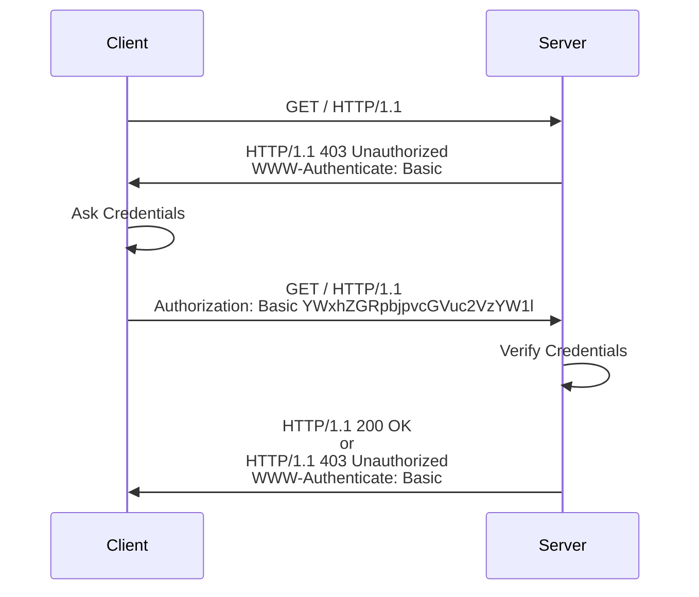

# Basic Authentication[^1]

Basic Authentication refers to an authentication and authorization framework
and schema defined in [RFC9910](https://www.rfc-editor.org/rfc/rfc9110) and
[RFC7617](https://www.rfc-editor.org/rfc/rfc7617.html). RFC (Request For
Comments) documents are technical specifications for how the internet should
work.

In a nutshell, the Basic Authentication strategy is the following: The client
sends a request to the server. The server receives the request and checks for
the presence of the `Authorization` header. If the header is present, it checks
the credentials and, if the credentials are valid, responds with the
appropriate data. Otherwise, the server responds with a `401 Unauthorized` that
includes the `WWW-Authenticate` header set to `Basic`. When the client's
browser receives this response, it show a sign-in pop up, so the user can enter
their credentials, and the browser can send another request with the
`Authorization` header set with the given credentials encoded using Base64.

A typical flow would look something like this:



Basic Authentication is a simple authentication strategy that needs minimal
implementation: We don't have to create a login screens and handle the
submission of the credentials. Rather, modern browsers already have a built-in
implementation that automatically shows a sign in pop up, and sends the request
with the appropriate headers set with the given credentials. In this way, the
server can challenge a client for credentials, and the client will know how to
handle the challenge, present the challenge to the user, and send back the
appropriate response. At the back-end, we still have to retrieve the
credentials from the request and check whether they are valid.

It's worth pointing out that Basic authentication isn't a secure strategy: The
browser sends the credentials in the `Authorization` header encoded using
Base64. Specifically, the format of the `Authorization` header is: `Basic
Base64(username:password)`. Since Base64 is a reversible encoding scheme, then
if the connection itself isn't secure, this authentication method wouldn't be
secure: anyone can decode the credentials and retrieve the original the
username and password. Therefore, it should not be used to protect sensitive
information. The use cases for basic authentication would be when the server
only needs a thin layer of protection to prevent unregistered clients to easily
access the resources in the server. And even then some precautions have to be
in place. (Such as: clients should not be allowed to chose their own
passwords.)

After the browser authenticates the first request, it typically assumes that
the user also has authorization to access the other resources in the same
"folder". So, it we successfully authenticate in the URI
`https://example.com/docs/index.html`, the browser will assume we also should
have access to all resources under `https://example.com/docs/`, and it'll
automatically include the `Authorization` header in the subsequent requests.

The section of the code in the `index.js` file that implements the flow above
is this:

```javascript
fastify.get("/", async (req, reply) => {
  if (req.headers["authorization"]) {
    const [username, password] = decodeAuthorizationHeader(
      req.headers["authorization"]
    );

    if (username === "username" && password === "password") {
      reply.send({ body: "Welcome!" });
      return;
    }
  }

  reply.code(401).header("WWW-Authenticate", "Basic");
});
```

The strategy is fairly straightforward: if checks for the presence of the
`Authorization` header; if it's present, it retrieves and checks the
credentials, and if they are valid, respond with a welcome message. Otherwise,
it sends a 401 response with the `WWW-Authenticate` header set to `Basic`.

[^1]: **Disclaimer:** The code presented above and in the source files doesn't
  follow the security best practices that would be necessary in a real world
  application. The purpose of the code is to be as simple as possible, so the
  focus can be on the logic relevant to demonstrate the Basic Authentication
  strategy.
