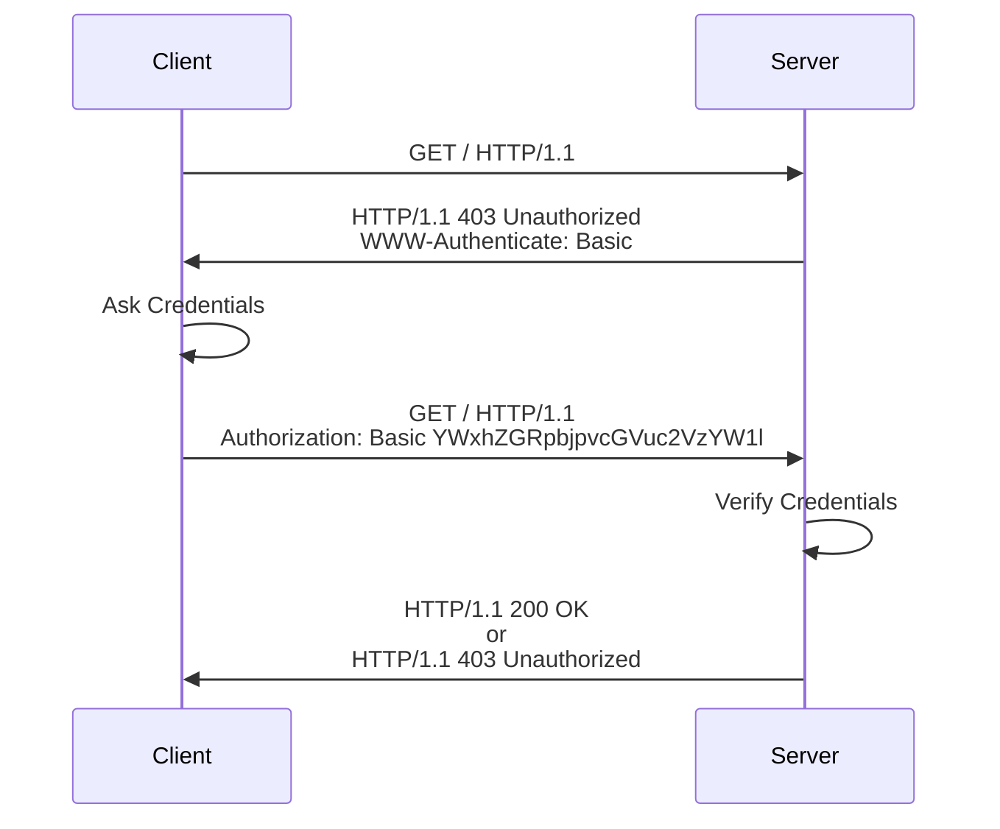

# Basic Authentication

In a nutshell, the **Basic Authentication** strategy is the following: The client
sends a request to the server. The server receives the request and checks for
the presence of the `Authorization` header. If the header is present, it checks
the credentials and, if the credentials are valid, responds with the
appropriate data. Otherwise, the server responds with a `401` with the
`WWW-Authenticate` header set to `Basic`. When the client's browser receives
this response, it show a sign-in pop up, so the user can enter their
credentials, and the browser can send another request with the `Authenticate`
header set with the given credentials.

A typical flow would look something like this:



Basic Authentication is mainly a front-end convenience: We don't have to create
a login screen and handle the submission of the credentials. Rather, the
browser automatically shows a sign in pop up, and sends the request with the
appropriate headers set with the given credentials. In this way, the server can
challenge a client for credentials, and the client will know how to handle the
challenge. But at the back-end, we still have to retrieve the credentials from
the request and check whether they are valid.

The browser sends the credentials in the `Authorization` header encoded in
base64. Specifically, the format of the `Authorization` header is: `Basic
base64(username:password)`. Note that base64 is a reversible encoding scheme.
Therefore, if the connection itself isn't secure, this authentication method
wouldn't be secure: anyone can decode the credentials and retrieve the original
the username and password.

The section of the code in the `index.js` file that implements the flow above
is this:

```javascript
fastify.get("/", async (req, reply) => {
  if (req.headers["authorization"]) {
    const [username, password] = decodeAuthorizationHeader(
      req.headers["authorization"]
    );

    if (username === "username" && password === "password") {
      reply.send({ body: "Welcome!" });
      return;
    }
  }

  reply.code(401).header("WWW-Authenticate", "Basic");
});
```

The strategy is fairly straightforward: if checks for the presence of the
`Authorization` header; if it's present, it retrieves and checks the
credentials, and if they are valid, respond with a welcome message. Otherwise,
it sends a 401 response with the `WWW-Authenticate` header set to `Basic`.
